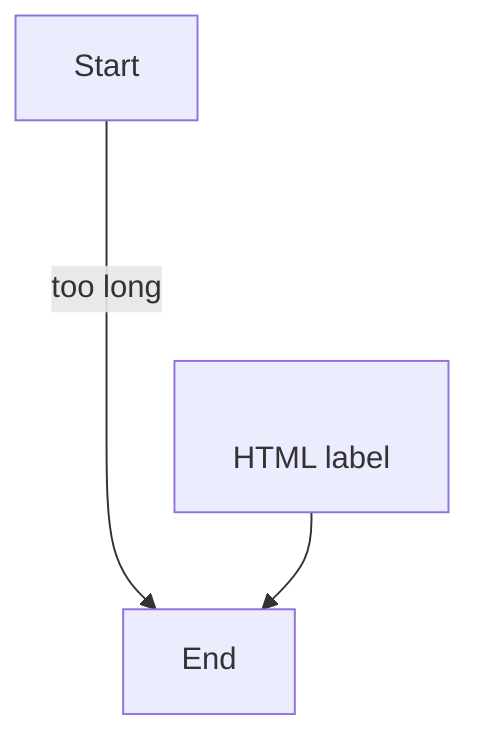

# Compatibility fixture

Every incompatibility the linter knows about, seeded once, so `Check this page for Azure
DevOps problems` can be verified by eye. **Do not "fix" this page** — that is the test.

## Links Obsidian understands and Azure DevOps does not

A plain wikilink to [[Home]], one with an alias [[Home|the front page]], one pointing at a
heading [[ADO Syntax Showcase#Work items]], and one at a page nobody has written yet
[[No Such Page]].

An embed of an attachment ![[==image_0==-4d1f5e6a.png]] and an embed of a page ![[Home]].

A link that resolves to nothing at all: [gone](/Product-Documentation/Deleted-Page), and a
[relative one](Home.md) that works today and breaks the moment either page moves.

## Inline syntax

Some ==highlighted text== that Azure DevOps prints with the equals signs, an
%%invisible comment%% that it publishes in full, a #project tag, and a footnote reference[^1].

[^1]: Footnotes render as literal text over there.

## Callout

> [!warning] Read this first
> The marker above stays visible on Azure DevOps.

## A table with no blank line around it

Azure DevOps renders the table below; Obsidian shows the rows as text unless the plugin
repairs the display, and the linter offers to repair the file.
| Setting | Value |
| --- | --- |
| Retry | 3 |
| Timeout | 30 s |
The paragraph after it ends the table on both platforms.

## A checklist inside a table

| Step | Done |
| --- | --- |
| Configure the pipeline | - [x] |
| Publish the wiki | - [ ] |

## Mermaid that Azure DevOps cannot draw

## An unterminated block

::: video https://example.com/a-recording
